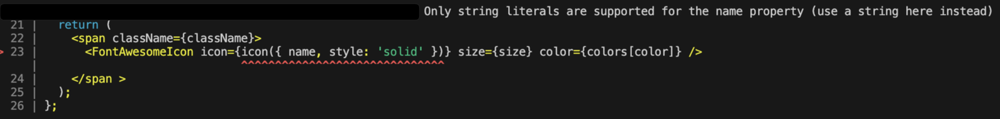

## gatsby-plugin-fontawesome-css 사용 안하기
공식 홈페이지에서 추천하는것 처럼 보이는 방식은 version이 안 맞는다는 경고가 뜬다. 이 플러그인은 업데이트가 안되어 있어서 버전이 안맞는다는 경고가 뜨며 어떤 글에서는 해당 플러그인이 아이콘 크기 버그 해결만을 위한 플러그인인이라고 하니 사용하지 않기로 결정했다.

`yarn add gatsby-plugin-fontawesome-css`
```
module.exports = {
  plugins: [`gatsby-plugin-fontawesome-css`],
}
```

## react-fontawesome 패키지를 설치
Gatsby는 React 기반이기 때문에 React 전용 react-fontawesome 패키지를 설치
```
{
    "dependencies": {
        "@fortawesome/fontawesome-svg-core": "^6.4.0",
        "@fortawesome/free-brands-svg-icons": "^6.4.0",
        "@fortawesome/free-regular-svg-icons": "^6.4.0",
        "@fortawesome/free-solid-svg-icons": "^6.4.0",
        "@fortawesome/react-fontawesome": "^0.2.0"
    }
}
```

## dynamic 방법의 문제점
폰트를 사용하는 방법은 여러개가 있는데, 나는 공통 컴포넌트를 만들어 사용할것이기 때문에 string으로 props를 넘겨서 사용할 수 있는 [dynamic 방법](https://fontawesome.com/docs/web/use-with/react/add-icons#dynamic-icon-importing)을 사용했다.

이 방법은 **Babel Macros** 플러그인 설정을 통해 사용할 아이콘을 일일이 import할 필요가 없으면서도 사용한 아이콘만 번들에 포함하도록 자동으로 **번들 최적화**하는 방법이다. `이 방법은 공식 홈페이지에서도 추천하는 방법!`

대신 몇가지 설정을 해주어야 한다.
`yarn add babel-plugin-macros`

`babel.config.js `
```
module.exports = function (api) {
 	//여기에서 캐시 오류가 났기 때문에
	api.cache(true);
    return {
      plugins: ['macros'],
    }
}
```
`babel-plugin-macros.config.js`
```
module.exports = {
  'fontawesome-svg-core': {
    'license': 'free'
  }
}
```

그런데 여기서 `충격적인 오류`가 또 발생했다.
```jsx
import { FontAwesomeIcon } from '@fortawesome/react-fontawesome'
import { icon } from '@fortawesome/fontawesome-svg-core/import.macro'
import { Color, FoundationProps } from "../../models/types";
import { SizeProp } from '@fortawesome/fontawesome-svg-core';
import colors from '../../constants/colors';

export type IconProps = {
  name:
  | "moon" | "bars"
  size?: SizeProp
  color?: Color;
};

const Icon = ({
  className,
  name,
  size = "4x",
  color = "primary3",
}: IconProps & FoundationProps) => {
  return (
    <span className={className}>
      <FontAwesomeIcon icon={icon({ name, style: 'solid' })} size={size} color={colors[color]} />
    </span >
  );
};

export default Icon;
```

@fortawesome/fontawesome-svg-core/import.macro는 icon 매크로를 호출할때, name 속성 지정할 수 있다. 내가 놓친 부분은 icon 매크로가 반환하는 `아이콘 정보는 build time에 고정`되게 된다는 것이였다.

내가 수행했던 방식은 **build time이 아닌 runtime 중에만 동적으로 실제 name을 가져올 수 있었기 때문에, icon 매크로를 수행하는 build time에는 referenced icon을 알 수 있기 때문에 해당 오류가 발생했다.** 

`Only string literals are supported for the name property (use a string here instead)`



그래서 다시 다른 방법으로 고고뤼! 

## 두가지 해결 방법
내가 생각한 해결방법은 아래 2가지 이다. 

### 1. 각각 import 해주는 방식
```jsx
import { FontAwesomeIcon } from '@fortawesome/react-fontawesome';
import { faMoon, faBars } from '@fortawesome/free-solid-svg-icons';

...

let selectedIcon = '';
if(props.name === "moon") selectedIcon= faMoon; 

...
```
### 2. 그대로 babel macro를 사용하면서 미리 icon 매크로로 name 지정하여 referenced icon을 가져온 후 객체에 저장해놓는 방법

```jsx
import { FontAwesomeIcon } from '@fortawesome/react-fontawesome'
import { icon } from '@fortawesome/fontawesome-svg-core/import.macro'

const icons = {
  moon: icon({ name: "moon", style: 'solid' }),
  bars: icon({ name: "bars", style: 'solid' }),
}

...

const selectedIcon = props.name[name];

...
```

## 최종 나의 선택은!
나는 추가로 여러가지의 아이콘을 가져올 예정이였기 때문에 하나하나 icon을 import 해주지 않으면서도 번들 최적화를 수행해주는 아래의 방식을 선택하였다.

```jsx
import { FontAwesomeIcon } from '@fortawesome/react-fontawesome'
import { icon } from '@fortawesome/fontawesome-svg-core/import.macro'
import { Color, FoundationProps } from "../../models/types";
import { SizeProp } from '@fortawesome/fontawesome-svg-core';
import colors from '../../constants/colors';

const icons = {
  moon: icon({ name: "moon", style: 'solid' }),
  bars: icon({ name: "bars", style: 'solid' }),
}

export type IconProps = {
  name:
  | "moon" | "bars"
  size?: SizeProp
  color?: Color;
};

const Icon = ({
  className,
  name,
  size = "4x",
  color = "primary3",
}: IconProps & FoundationProps) => {
  return (
    <span className={className}>
      <FontAwesomeIcon icon={icons[name]} size={size} color={colors[color]} />
    </span >
  );
};

export default Icon;
```
