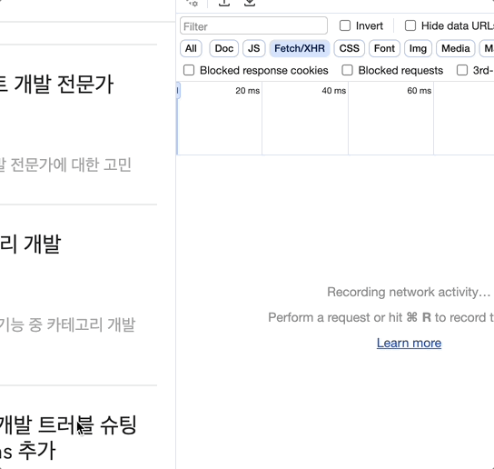
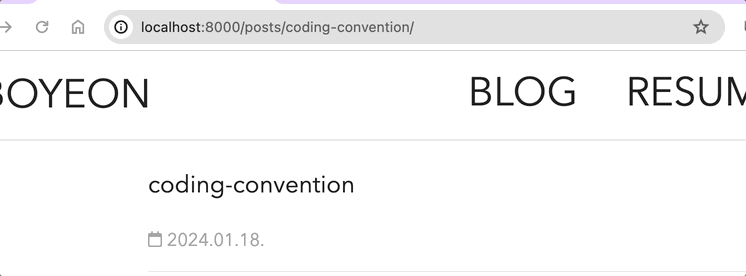

Gatsby에서는 빌트인 Link Component(플러그인이 아닌 기본으로 제공하는 api)를 기본적으로 제공한다. 이 api는 내부 페이지들 사이를 높은 성능으로 라우트 해주고 프로그래밍적인 네비게이션을 제공해주는 navigation function을 포함한다.

> Link component는 Reach Router를 확장한것.

---

# 빠른 페이지 이동
Link Component는 `프리로딩`를 하기 때문에 빠른 성능을 보여준다. 프리로딩은 사용자가 어떤 페이지에 들어왔을 때 사용가능한 페이지를 미리 가져오는 것(`프리패치`)을 의미한다. 

가장 먼저 브라우저의 `intersection observer api`를 사용하여 Link component가 `viewport`에 들어왔다면 `낮은 우선순위`로 프리패치한다. 그리고 만약 `onMouseOver`가 트리거나 되면 `우선순위를 높인다`. 이러한 두 단계의 프리로링은 사용자가 link를 클릭하자마자 페이지를 볼 수 있도록 하여 `사용자 경험을 크게 높인다`. (latency users experience를 크게 줄임)



---

#  navigate helper function
navigat 함수은  Link Component를 사용할 수 없는 코드 구문에서 사용한다. 다양한 매개변수를 보내 기능을 수행할 수 있다.
#### 1. basic navigate
```javascript
import React from "react"
import { navigate } from "gatsby"

const Form = () => (
  <form
    onSubmit={event => {
      event.preventDefault()

      // TODO: do something with form values
      navigate("/form-submitted/")
    }}
  >
    {/* (skip form inputs for brevity) */}
  </form>
)
```

#### 2. navigate(-n)
이전 페이지로 돌아가려면 navigate(-1)을 사용하면 된다. 
>  내부에서는 histoty.go함수를 쓰기 때문에 어떤 숫자든 가능한다.

#### 3. querystring이나 fragment도 navigate함수를 통해 추가 가능
```javascript
import { navigate } from 'gatsby';

...

onClick = () => {
  navigate('#some-link');
  // OR
  navigate('?foo=bar');
}
```

---

# Relative links
해당 api는 후행 슬래시는 무시하며 각각의 페이지를 마치 디렉토리 처럼 다룬다. 따라서 만약 /blog/my-great-page or /blog/my-great-page/ 해당 페이지에서 다른 페이지로 이동하기 위해서는 ../second-page이렇게 넣어주어야 /blog/second-page 이동한다.

만약 localhost:8080/posts/title 의 page에서 아래와 같이 Link 컴포넌트에서 바로 blog로 이동해준다면 localhost:8080/posts/title을 기준으로 localhost:8080/posts/title/blog가 되어 404에러가 발생한다.


```jsx
<Link to={"blog"}>
    <StyledTypography variant="h0" >{value.toUpperCase()}</StyledTypography>
</Link>
```

따라서 마치 폴더구조 부모의 부모로 link의 위치를 잡아주면 정상적으로 동작한다.


```jsx
<Link to={"../../blog"}>
    <StyledTypography variant="h0" >{value.toUpperCase()}</StyledTypography>
</Link>
```