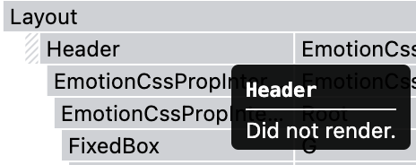
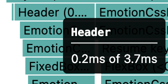
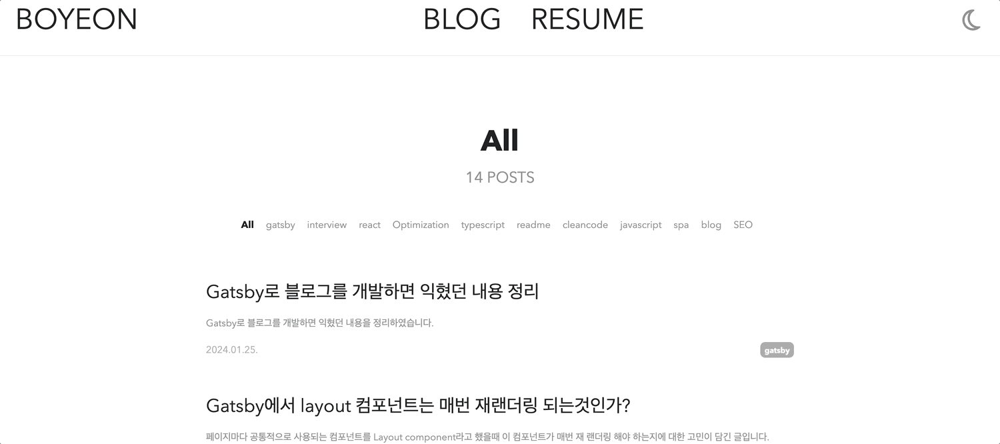
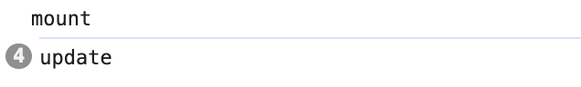

Gatsby는 CSR처럼 엔트리 파일이 없고 **각각 페이지가 최상단 페이지** 파일입니다. 따라서 아래와 같은 문제가 발생합니다.

## 1. 불필요한 재랜더링
블로그를 구현하면서 Header, footer와 같은 반복적인 UI를 Layout 컴포넌트에 구현하였습니다. 그리고 main의 내용은 children props로 받아 오도록 구현하였습니다. Gatsby는 엔트리 파일이 없고 **각각 페이지가 최상단 페이지** 파일이기 때문에 Header, footer와 같이 반복되는 컴포넌트들을 적용시키려면 **매번 wrapper**로 적용해주어야 했습니다. 

따라서 매번 **반복되는 코드**를 작성해야 되기 때문에 **개발 생산성**을 감소시켰고, 불필요한 **재랜더링**으로 인하여 **사용자 경험**을 떨어트렸습니다.

## 2. state 초기화
또한, 저는 dark mode 구현을 위한 theme state를 페이지 이동시에도 유지해주어야 했습니다. 그렇지만 역시 최상단 페이지가 없는 Gatsby에서는 해당 데이터가 유지 되지 않는다는 이슈가 있었습니다.

# wrapRootElement

저는 먼저 이 문제를 해결하기 위해서 앱의 루트 요소를 감싸기 위한 함수인 wrapRootElement를 사용해서 공통적으로 사용되는 Layout component가 앱이 로드될 때 한 번 실행되도록 구현했습니다.

```jsx
export const wrapRootElement = ({
    element
}: {
    element: React.ReactNode
}): React.ReactNode => {
    return (<Layout>{element}</Layout>)
}
```

이렇게 구현한 결과 header **전체가 리랜더링** 되지 않았고, 페이지가 이동되더라도 dark mode와 관련된 **state가 초기화** 되지 않았습니다. 제가 원하던 결과입니다!!




그렇지만 위의 방법대로 구현한 결과 다음과 같은 오류가 발생했습니다.

> wrapRootElement in gatsby-ssr/gatsby-browser doesn't contain UI elements 

공식홈페이지를 다시 읽어보니 wrapRootElement로는 **Privider만 export** 할수 있고 **UI elements가 담기 컴포넌트**는 wrapPageElement에서 사용할 수 있었습니다.

# wrapPageElement (📌최종)
wrapPageElement는 페이지의 루트 요소를 감싸는 컴포넌트이지만 페이지 이동시에도 unmounted 되지 않습니다. 따라서 내가 작성한 Layout 컴포넌트를 wrapRootElement가 아닌 wrapRootElement API를 통해 export 해주는 방식으로 수정했습니다.

```jsx
export const wrapPageElement = ({
    element
}: {
    element: React.ReactNode
}): React.ReactNode => {
    return (<Layout>{element}</Layout>)
}
```

wrapPageElement로 구현한 경우 page 이동시 매번 layout component 요소들이 **재랜더링** 되지만 내부의 **state는 초기화** 되지 않았습니다.






따라서 해당 컴포넌트들은 update 되는것으로 예상이 되었고, Profiler API를 활용하여 확인해보았습니다. Profiler의 onRender 콜백에는 마운트된 상태와 리랜더링된 상태를 구분할 수 있는 phase 값이 존재합니다. 해당 값을 console 창에 출력해보았습니다.

```jsx
const Header = () => {
    return (
        <Profiler id="hedaer"
            onRender={(
                id,
                phase,
                actualDuration,
                baseDuration,
                startTime,
                commitTime,
                interactions,
            ) => {
                console.log(phase);
            }}>
            <header css={headerStyle.height}>
                ...
            </header>
        </Profiler>
    );
};
```

그 결과로는 처음 앱에 진입했을때만 mounted 되고 나머지는 update 되는것으로 확인이 되었습니다. 결국 wrapPageElement를 써서 page 마다 공통되는 컴포넌트를 감싸주면 재랜더링이 되긴 하지만 update가 되며 mounted가 되지 않으니 state는 초기화 되지 않는다는 점을 알게 되었습니다.



# 결론

결국 Gatsby에서 최상단 페이지가 없어 발생하는 문제들을(**반복되는 코드, state 유지 안됨**) wrapPageElement를 통해 해결할 수 있었습니다. 