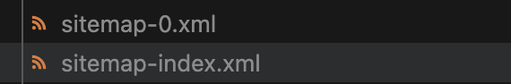

# 검색엔진을 최적화
Gatsby에서 meta tag, sitemap를 통해 검색엔진을 최적화 해보려고 한다.

# Head API에 meta tag
## Head export
Gatsby에서는 **build-in Head export**를 제공한다. 이는 react-helmet과 비교했을때 성능, 번들 사이즈, 사용 방법 등등 다양한 장점이 존재한다고 한다. (gatsby@4 .19.0부터 등장)

사용방법은 component에서느 **Head라는 이름의 function을 export** 해주면 된다. 그리고 내부 내용은 html의 head에서 사용하는 태그들을 그대로 사용하면 된다.

```jsx
import { HeadFC } from "gatsby";
import { GraphQLNode } from "../models/types";
import * as React from 'react'

export const Head: HeadFC<GraphQLNode> = ({
    data: { site:
        { siteMetadata:
            {
                title,
                description,
                image,
                siteUrl
            }
        }
    }
}) => {
    return (
        <>
            <title>정보연 블로그</title>
            <meta name="description" content={description} />
            <meta name="viewport" content="width=device-width, initial-scale=1.0" />
            <meta httpEquiv="Content-Type" content="text/html;charset=UTF-8" />

            <meta property="og:type" content="website" />
            <meta property="og:title" content={title} />
            <meta property="og:description" content={description} />
            <meta property="og:image" content={image} />
            <meta property="og:url" content={siteUrl} />
            <meta property="og:site_name" content={title} />
        </>
    )
}
```

```jsx
export default Blog
export { Head } from "../components/head"
```

## 주의할점
- Head export는 반드시 **page에서만** 정의할 수 있다.
- Head는 페이지가 **unmount할때 지워진다**. 따라서 각각의 페이지에서 export 해주어야 한다.

---

# Sitemap
sitemap은 xml형태의 **url리스트**입니다. 이는 검색엔진에게 노출되었으면 하는 페이지를 전달하여 크롤링 속도를 높이는 방식으로 seo를 최적화 하는 방법입니다.

Gatsby로 만든 제 블로그는 md파일이 계속해서 생성되는 페이지이기 때문에 sitemap을 **지속적으로 관리하기에는 어려움**이 있습니다. 따라서 프로젝트를 빌드 할때 자동으로 생성되는 페이지에 대해서 Sitemap에 추가해주는 [라이브러리](https://www.gatsbyjs.com/docs/how-to/adding-common-features/creating-a-sitemap/#using-gatsby-plugin-sitemap)를 사용하려고 합니다.

```shell
yarn add gatsby-plugin-sitemap
```

> gatsby-config.js
```js
module.exports = {
  siteMetadata: {
    siteUrl: `https://www.example.com`,
  },
  plugins: [`gatsby-plugin-sitemap`],
}
```

gatsby build를 수행하면 public에 sitemap-0.xml과 sitemap-index.xml 파일이 생성됩니다. 
> 이렇게 생성되는 이유는 몇몇 웹 마스터 도구에서 특정 개수의 url을 포함하는 sitemap은 인식하지 못하는 문제점이 있기 때문에 나눠서 저장해야 하기 때문이라고 합니다
