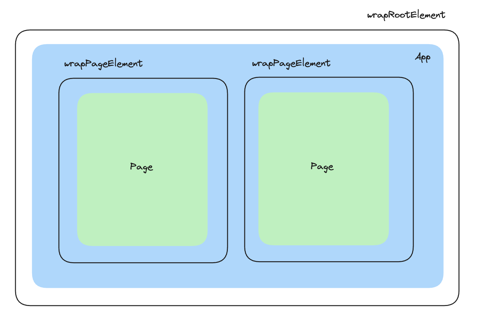

Gatsby로 블로그를 개발하면 익혔던 내용을 정리하였습니다. 
> 공식문서를 보고 공부하였으며 좀 더 자세한 내용은 공식문서를 참고하세요.

# 전체적으로 살펴보기

**Buil-in React Components**에는 Link, Script, Head, Image plugin, Slice 등이 존재합니다.

그리고 추가적인 기능을 사용할 수 있도록 다양한 **config 파일**이 존재하고 그 내부에서 사용하는 api들이 각각 다릅니다. 

1. gatsby-node.js
2. gatsby-browser.jsx
3. gatsby-ssr.js
4. gatsby-config.js

---

# config 파일
#### 1️. gatsby-config.js
주로 사이트의 metadata, plugins를 관리하는데 사용됩니다. 

#### 2️. gatsby-node.js
Gatsby Node API들을 사용할 수 있는 config 파일입니다. build 과정에서 한번만 실행됩니다. 주로 page를 동적으로 생성하거나 GraphQL에 데이터를 추가할때 사용합니다.

#### 3.  gatsby-ssr.js 
Gatsby SSR API들을 사용할 수 있는 config 파일입니다. SSR API들을 통해 SSR로 만들어진 static한 HTML 파일을 수정할 수 있습니다. 
> onPreRenderHTML, onRenderBody, replaceRenderer, wrapPageElement, wrapRootElement

#### 4️. gatsby-browser.jsx
Gatsby Browser API들을 사용할 수 있는 config 파일입니다. 이 API들은 cliend-side와 인터렉션 할수 있는 다양한 option을 제공해줍니다. 그렇기 때문에 brower에서 제공하는 기능들을 사용할 수 있습니다. 
> onClientEntry, onPrefetchPathname, onServiceWorkerActive, replaceHydrationFunction, wrapPageElement, wrapRootElement..

---

# wrapRootElement와 wrapPageElement
wrapRootElement, wrapPageElement API는 비슷한 기능을 제공하는 API입니다. 그렇지만 이들은 사용하는 시점이 다릅니다. 

#### 1️. wrapRootElement
wrapRootElement는 **앱의 루트 요소**를 감싸기 위한 함수입니다. **앱이 로드될 때 한 번** 실행됩니다. 이 함수는 주로 전역적인 컨텍스트 제공이나 앱의 초기 설정에 사용됩니다.

#### 2. wrapPageElement
각 **페이지의 루트 요소**를 감싸기 위한 함수입니다. **페이지가 로드될 때마다 호출**됩니다. 페이지 전환 간에 상태를 유지하거나 특정 페이지에만 효과를 주고 싶을 때 사용될 수 있습니다.

> 이 API들은 Gatsby의 SSR, CSR API에서 모두 제공하는 API입니다. 따라서 SSR 랜더링한 결과와 하이드레이션 한 결과가 같으려면 반드시 gatsby-ssr.js, gatsby-browser.jsx 내부에 wrapRootElement와 wrapPageElement API들을 동일하게 작성해주어야 합니다. 