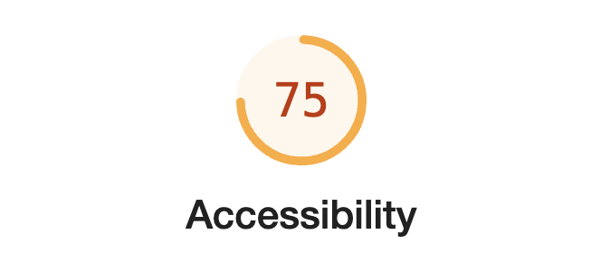

blog를 개발 후 lighthouse에 진단을 받아보았습니다. 항목중에서 가장 개선이 필요한 부분은 accessibility였습니다. 차근차근 문제에 대해 살펴보고 개선해보려고 합니다.


---

# 컬러 대비 비율

### ✔️ before
요소간의 컬러 차이가 충분하지 않으면 웹 사이트 사용자 경험이 저하될 수 있습니다.


### ✔️ 해결
Web Content Accessibility Guidelines (WCAG)는 텍스트 및 이미지의 컬러 대비에 대한 권고사항을 제공합니다. 일반적으로 텍스트와 배경 사이의 대비 비율은 최소한 4.5:1이어야 하며, 대부분의 큰 텍스트에는 3:1이 필요합니다.

두 요소간의 컬러 차이가 WCAG에 부합할 수 있는 [사이트](https://webaim.org/resources/contrastchecker/)가 존재한다.


### ✔️ after
컬러 차이를 WCAG에 맞게 다시 수정하고 다시 lighthouse을 진단 받았습니다. 점수가 높아졌습니다!!


---

# button name / ul li / html lang
간단하게 몇가지를 수정해서 accessibility를 최적화 할 수 있었습니다. 모두 스크린 리더가 잘 인식할 수 있도록 하는 작업입니다.

### ✔️ ul li
기존에 ul li 사이에 불필요한 div가 있었는데, 이 부분 또한 스크린 리더가 인식하는데 이슈가 있다고 합니다.


### ✔️ html lang
html에 lang attribute가 없으면 default 언어로 지정되기 때문에 반드시 추가해주어야 합니다.


### ✔️ button name
button 이름을 지정해주지 않으면 스크린 리더에서 사용할 수 없어서 추가해주어야 합니다.


```jsx
const Button = ({ className, children, onClick, buttonName }: FoundationProps & ButtonProps) => {
  return <button onClick={onClick} className={className} aria-label={buttonName}>{children}</button>;
};
```

---

# 결과

위에서 정리한 4가지를 수정해주고 다시 검사해봤을때는 100점이 나왔다! 최적화 방법중에서 accessibility을 집중해서 수정하다보니 **모두에게 공평한 서비스를 제공**할 수 있는 방법에 대해 많은 고민을 하게 되어서 좋았다. 웹을 개발할때 항상 이 부분을 생각하며 개발해야 겠다 :)
