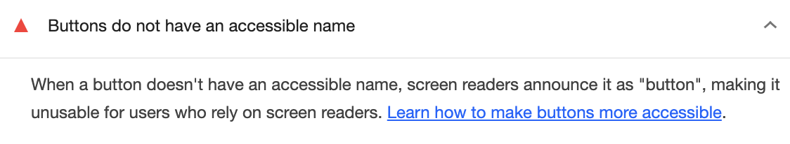

저의 개인 블로그를 개발한 후, Lighthouse를 통해 받은 진단을 받아보았습니다. Lighthouse는 가장 개선이 필요한 부분으로 웹 접근성(Accessibility)을 지목했습니다. 이에 따라 Lighthouse에서 추천하는 방법을 따라가며 Accessibility 점수를 올리고 사용자 접근성을 개선하는 과정에 대해 이야기하고자 합니다.


# 컬러 대비 비율
첫번째로 Lighthouse는 요소간의 컬러 비율을 조절하는 방법을 제안해주었습니다. 요소간의 컬러 차이가 충분하지 않으면 웹 사이트 사용자 경험이 저하될 수 있습니다. 


Web Content Accessibility Guidelines (WCAG)는 텍스트 및 이미지의 컬러 대비에 대한 권고사항을 제공합니다. 일반적으로 텍스트와 배경 사이의 대비 비율은 최소한 4.5:1이어야 하며, 대부분의 큰 텍스트에는 3:1이 필요합니다.

> 저는 두 요소간의 컬러 차이를 WCAG에 부합할 수 있도록 계산해주는  [사이트](https://webaim.org/resources/contrastchecker/)를 활용했습니다.


# 스크린 리더 최적화
스크린 리더란 시각 장애인을 위한 보조 기기로, 웹 페이지의 내용을 읽어주는 소프트웨어입니다. Lighthouse 진단 결과, 제 블로그에서는 스크린 리더가 웹 페이지를 잘 인식할 수 없도록 구현된 부분이 있어 개선이 필요하다고 알려주었습니다.

## 1. ul li
기존에는 ul li 요소 사이에 불필요한 div가 삽입되어 있었는데, 이로 인해 스크린 리더가 웹 페이지를 인식하는 데 문제가 있었습니다. 이 부분도 개선하여 스크린 리더가 웹 페이지를 더 정확하게 이해할 수 있도록 조치하였습니다.


## 2. html lang
또한, 웹 페이지의 언어를 명시하는 lang 속성이 없으면 기본(default) 언어로 지정되어 스크린 리더가 적절하게 처리하지 못할 수 있습니다. 이 문제를 해결하기 위해 lang 속성을 추가하여 웹 페이지의 언어를 명확히 지정해주었습니다.


## 3. button name
마지막으로, 버튼에 이름을 지정하지 않으면 스크린 리더 사용자가 해당 버튼을 인식할 수 없는 문제가 있습니다. 이에 따라 버튼에 명확한 이름을 추가하여 스크린 리더가 버튼의 기능을 정확하게 이해할 수 있도록 개선해주었습니다.


```jsx
const Button = ({ className, children, onClick, buttonName }: FoundationProps & ButtonProps) => {
  return <button onClick={onClick} className={className} aria-label={buttonName}>{children}</button>;
};
```

# 결과

수정 후에 다시 검사해본 결과, 모든 항목에서 100점을 받았습니다! Accessibility에 집중하여 수정함으로써 모두에게 공평한 서비스를 제공할 수 있는 방법에 대해 많은 고민을 하게 되었습니다.
